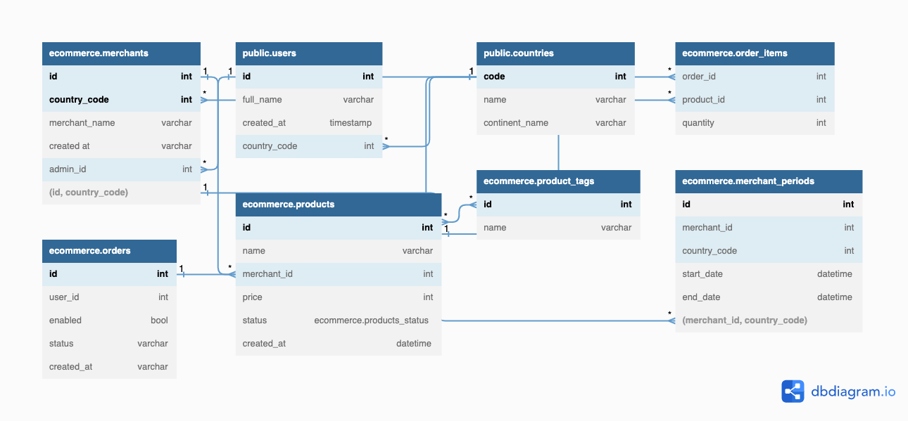

# strapi-pos (WIP)

A Strapi v4 base using PostgreSQL, Typescript, Docker and Docker Compose

## Development deployment

1. Setup .env file in `app` directory.

2. Install `npm` dependencies (run command in `app` directory and in `app/src/plugins/dashboard` directory)

    ```bash
    cd app && npm i && cd src/plugins/dashboard && npm i && npm run build && cd ../../../../
    ```


### Development Mode: Launch db and strapi

```bash
docker-compose -f docker-compose.yml -f docker-compose.dev.yml up -d db && cd app && npm run develop && cd ..

// Shutdown development database (optional)
docker-compose -f docker-compose.yml -f docker-compose.dev.yml down
```


## Production deployment

1. Build Strapi admin panel (run command in `app` directory)

    ```bash
    npm run build
    ```

2. Run with Docker Compose (run in repository root directory)

    ```bash
    docker-compose up -d --build
    ```

## Schema Diagram
